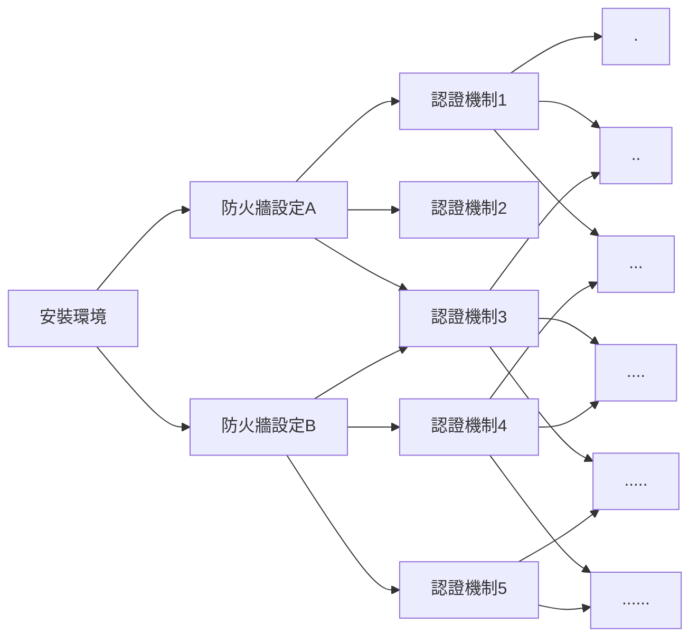

# Ansible 簡介

## Why Ansible

### 在一個 AWS instance 上架設伺服器：

1. 安裝環境 (Python、Docker...)
2. 設定防火牆、安裝/匯入認證
3. 安裝 AWS Cli tool
4. 設定 AWS Cli tool
5. Pull docker images<br/>
   ....<br/>
   ....<br/>
   ....<br/>
   


### 在四個 AWS instance 上架設伺服器：

重複以上步驟 x4


### 在一百個 AWS instance 上架設伺服器：

重複以上步驟 x100 :dizzy_face:


<iframe width="420" height="315"
src="https://www.youtube.com/embed/IMUT8EhTqJM">
</iframe>

:::success
:point_right: 需要一個工具可以重複執行相同步驟
:::

### 如果每個伺服器還有著不同的設定...:dizzy:


:::success
:point_right: 這個工具可以套用不同設定到模板來完成工作
:::

### 每架一個伺服器就要重新再安裝一次所有工具... :open_mouth::dash:
 


:::success
:point_right: 不用每台機器都需要重新安裝工具 (agentless)
:::

:::success
:point_right: 最好易懂易讀，容易上手
:::

## What is Ansible

### 甚麼是 Ansible：
:::warning
Ansible 是一套以 Python 為基底開發的組態管理工具
:::


### Ansible的優點：
* 免費: Anisble是一套免費的開源工具 (Redhat的AAP和Ansible Tower則是收費工具)。
* 模板化的設計: Anisble主要使用==YAML==和==Jinja2==模板語法來進行撰寫，可重複使用模板搭配不同的環境變數來執行各種IT工作。
* 不需在每個節點上安裝： 被控制的節點只需要安裝Python和SSH就可以統一由控制節點來進行控管，節省資源與時間。
* 易讀易懂：如前述所說，Ansible playbook (後面會在說明playbook是甚麼)的語法為YAML，YAML一開始就是被設計成容易編寫和閱讀的(雖然有些人會不認同XD)。
* 容易學習：只需要了解如何在Linux環境下工作以及理解如何使用SSH操控遠端機器就可以使用。

## How to use Ansible

### Ansible的基本架構：
#### Playbook
Playbook是Ansible世界的一個專有名詞，
代表Ansible用來配置組態的一個腳本，以YAML來進行撰寫。
#### Plays
Playbook由一連串的plays所組成，
每個Play包含：
* 一組想要進行組態配置的==主機(hosts)==
* 要在這些主機上執行的一系列==任務(tasks)==
#### Tasks
Task為組成一個Playbook的最小單位，每個Task都必須包含一個==Key==。
Key代表了模組(module)的名稱以及要傳遞到模組的參數值。


以下是一個task的範例：
```
- name: Install required packages
  apt:
    name: "{{ item }}"
    state: latest
    update_cache: true
  loop: "{{ required_package }}"
```

其中name是完全optional的，但是寫出來可讓同事(以及半年後的自己)比較能了解這個task的目的是甚麼。
apt就是前面講的key，表示我們要用apt這個模組來下達指令

#### Modules
Module為Ansible原生已經包裝好的腳本，常見的有：
* apt: 使用apt套件管理員安裝或移除套件
* copy: 從本地機器複製檔案到本機其他位置或是其他主機
* file: 設定檔案、連結或目錄的屬性
* template: 使用Jinja模板生成檔案，並複製到主機中

所以前面例子的apt其實就是在command line打入
```
$apt install {{package1}} {{package2}} {{package3}}... --latest
```

Ansible原生沒有包含的模組也可以用plugin的形式來擴充

#### Plugins
就如同許多開源專案一樣，許多你想用的功能都已經有其他人幫你寫好了，只要下載下來安裝就可以使用。
例如常見的docker：
```
- name: Create config foo (from a file on the target machine)
  community.docker.docker_config:
    name: foo
    data_src: /path/to/config/file
    state: present
```

docker前面的==community==就表示這是由開源社群所撰寫的plugin。

#### Roles
隨著管理的規模和複雜度越來越高，Ansible也提供使用者可以用role來區分包裝不同的tasks
讓管理pipeline和task間的相依性更加容易
甚至使用者還可以去[Ansible Galaxy](https://galaxy.ansible.com/home)來下載其他人已經定義好的role來直接套用在專案使用。

#### Facts (or Vars?)
使用者可以自訂義環境變數來套用在Ansible的模板裡
有許多方式可以定義環境變數，以下簡單舉例：
1. 直接寫在playbook中
```
vars:
    key_file: /etc/nginx/ssl/test.key
    cert_file: /etc/nginx/ssl/test.crt
    server_name: localhost
```

2. 定義一個變數檔案
```
vars_files:
    - nginx,yml
```

3. 執行 playbook 的時候設定
```
$ ansible-playbook example.yml -e token=12345
```

4. 使用 set_fact
```
- set_fact: app_version={{ example_app_versnio }}
```

要在run-time確定目前的變數是甚麼，可用debug key來印出變數的值：
```
- name: Install path
    debug:
      msg: "Install path is {{ install_path }}."
```
:::success
:bulb: 定義變數的方式不同，其優先程度也不相同，例如直接用command line送進去的變數就會覆蓋掉playbook裡面原本有寫的變數
:::

#### Anisble的結構
Ansible的結構如果圖形化之後大致是長這樣：
[圖片出處](https://www.clickittech.com/tutorial/ansible-playbook-basic/)

### 實際上來跑跑看：
```
# Play: Install Smart Dock Server
- hosts: localhost  
  become: yes
  become_user: root

  vars_files:
  - "./inventory/smartdock.yml"
  - [ "/etc/smart-dock/user.yml", "./inventory/user.yml"]

  tasks:  
  - name: set current dir
    shell: "pwd"
    register: directory_out
  
  - set_fact: current_dir="{{ directory_out.stdout }}"  

  - fail:
      msg: Cannot find AWS access key ID and secret access key
    when: not aws_access_key_id|default(None) or not aws_secret_access_key|default(None)

  - name: Set install path
    pause:
      prompt: "Please specify your install path (default: /usr/local)"      
    register: install_path_input
    when: not install_path|default(None)

  - name: Set install path
    set_fact: 
      install_path="{{ install_path_input.user_input }}"
    when: not install_path|default(None)

  # If user press enter and skip the previous step
  - name: Set install path
    set_fact:
      install_path="/usr/local"
    when: not install_path|default(None)
  
  - name: Install path
    debug:
      msg: "Install path is {{ install_path }}."

  - name: create config directory
    file:
      path: "/etc/smart-dock"
      state: directory
      mode: '0755'

  - name: Save user configs
    ansible.builtin.template:
      src: "{{ current_dir }}/inventory/templates/user.j2"
      dest: "/etc/smart-dock/user.yml"
      mode: '0755'
      force: true

  - name: Check if certificates exist
    find:
      paths: ./certs
      patterns: "{{item}}"
    register: filesFound
    loop:
      - "ca.key"
      - "ca.pem"
      - "client.key"
      - "client.pem"
      - "openssl.cnf"

  - fail:
     msg: Cannot find self-signed certificates 
    when: item.matched == 0
    loop: "{{ filesFound.results }}"

  # Installing Packages
  - name: Install pip3
    apt:
      name: python3-pip
      state: latest
      update_cache: true

  - name: Upgrade pip
    pip:
      name: pip
      extra_args: --upgrade
      executable: pip3

  - name: Install boto3 python library
    pip:
      name: boto3
      state: present
    tags: services

  - name: Install boto python library
    pip:
      name: boto
      state: present
    tags: services

  # Import Role: Docker
  - name: Install and start docker service
    include_role:      
      name: docker
    tags: services
  
  # Import Role: Certificates
  - name: create letsencrypt certificates
    import_role:
      name: certificates
      tasks_from: letsencrypt_webroot
    when: certificate == "letsencrypt"
    tags: [services, certs]

  # Import Role: Smart Dock
  - name: Install smartdock server
    import_role:      
      name: smartdock
      tasks_from: setup_smartdock_server
    tags: smartdock
```

## Reference
[Ansible Documentation](https://docs.ansible.com/ansible/latest/dev_guide/index.html);<br/>
[Ansible建置與執行 O'Reilly](https://www.amazon.com/Ansible-Automating-Configuration-Management-Deployment/dp/1491915323);<br/>
###### tags: `ansible`,`note`