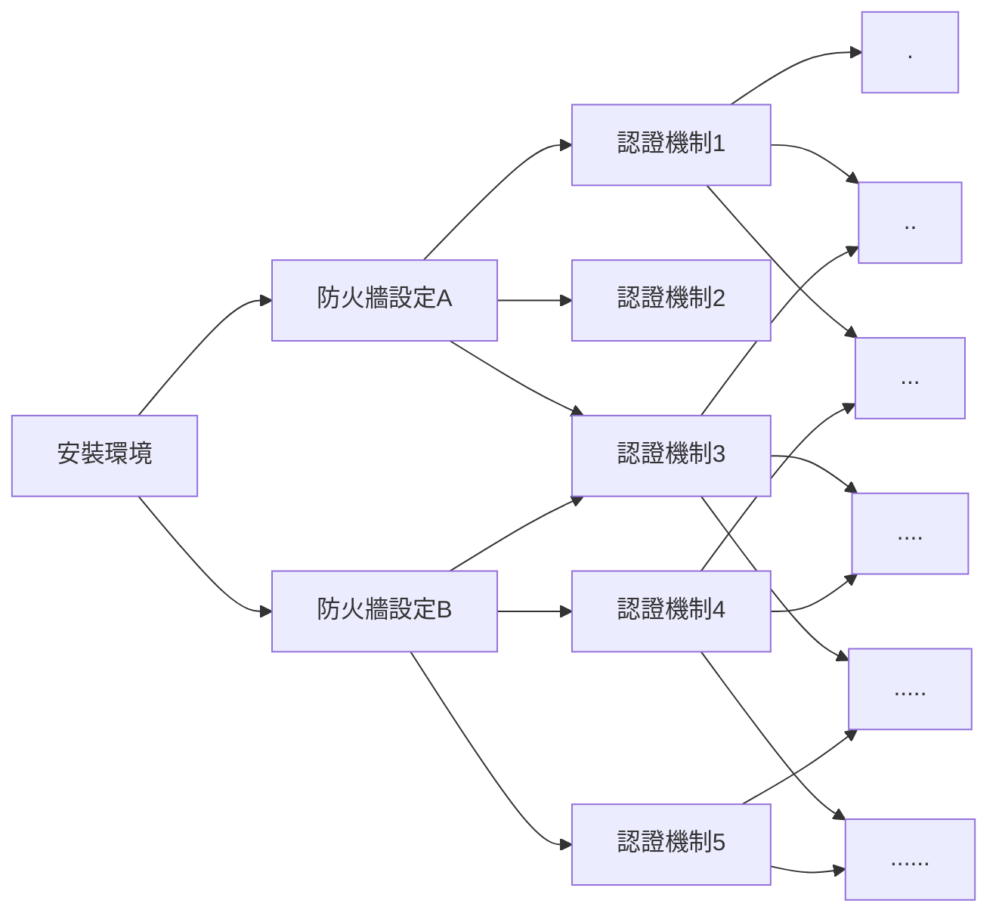

# Why Ansible

### 在一個 AWS instance 上架設伺服器：

1. 安裝環境 (Python、Docker...)
2. 設定防火牆、安裝/匯入認證
3. 安裝 AWS Cli tool
4. 設定 AWS Cli tool
5. Pull docker images 
   .... 
   .... 
   .... 
   

### 在四個 AWS instance 上架設伺服器：

重複以上步驟 x4

### 在一百個 AWS instance 上架設伺服器：

重複以上步驟 x100 :dizzy_face:

<iframe width="420" height="315"
src="https://www.youtube.com/embed/IMUT8EhTqJM">
</iframe>

:::success
:point_right: 需要一個工具可以重複執行相同步驟
:::

### 如果每個伺服器還有著不同的設定...:dizzy:

:::success
:point_right: 這個工具可以套用不同設定到模板來完成工作
:::

### 每架一個伺服器就要重新再安裝一次所有工具... :open_mouth::dash:
 

:::success
:point_right: 不用每台機器都需要重新安裝工具 (agentless)
:::

:::success
:point_right: 最好易懂易讀，容易上手
:::

# What is Ansible

## 甚麼是 Ansible：
:::warning
Ansible 是一套以 Python 為基底開發的組態管理工具
:::

## Ansible的優點：
* 免費: Anisble是一套免費的開源工具 (Redhat的AAP和Ansible Tower則是收費工具)。
* 模板化的設計: Anisble主要使用==YAML==和==Jinja2==模板語法來進行撰寫，可重複使用模板搭配不同的環境變數來執行各種IT工作。
* 不需在每個節點上安裝： 被控制的節點只需要安裝Python和SSH就可以統一由控制節點來進行控管，節省資源與時間。
* 易讀易懂：如前述所說，Ansible playbook (後面會在說明playbook是甚麼)的語法為YAML，YAML一開始就是被設計成容易編寫和閱讀的(雖然有些人會不認同XD)。
* 容易學習：只需要了解如何在Linux環境下工作以及理解如何使用SSH操控遠端機器就可以使用。

## Ansible的基本架構：
### Playbook
Playbook是Ansible世界的一個專有名詞，
代表Ansible用來配置組態的一個腳本，以YAML來進行撰寫。
### Plays
Playbook由一連串的plays所組成，
每個Play包含：
* 一組想要進行組態配置的==主機(hosts)==
* 要在這些主機上執行的一系列==任務(tasks)==
### Tasks
Task為組成一個Playbook的最小單位，每個Task都必須包含一個==Key==表示
# How to use Ansible
###### tags: `ansible`,`note`