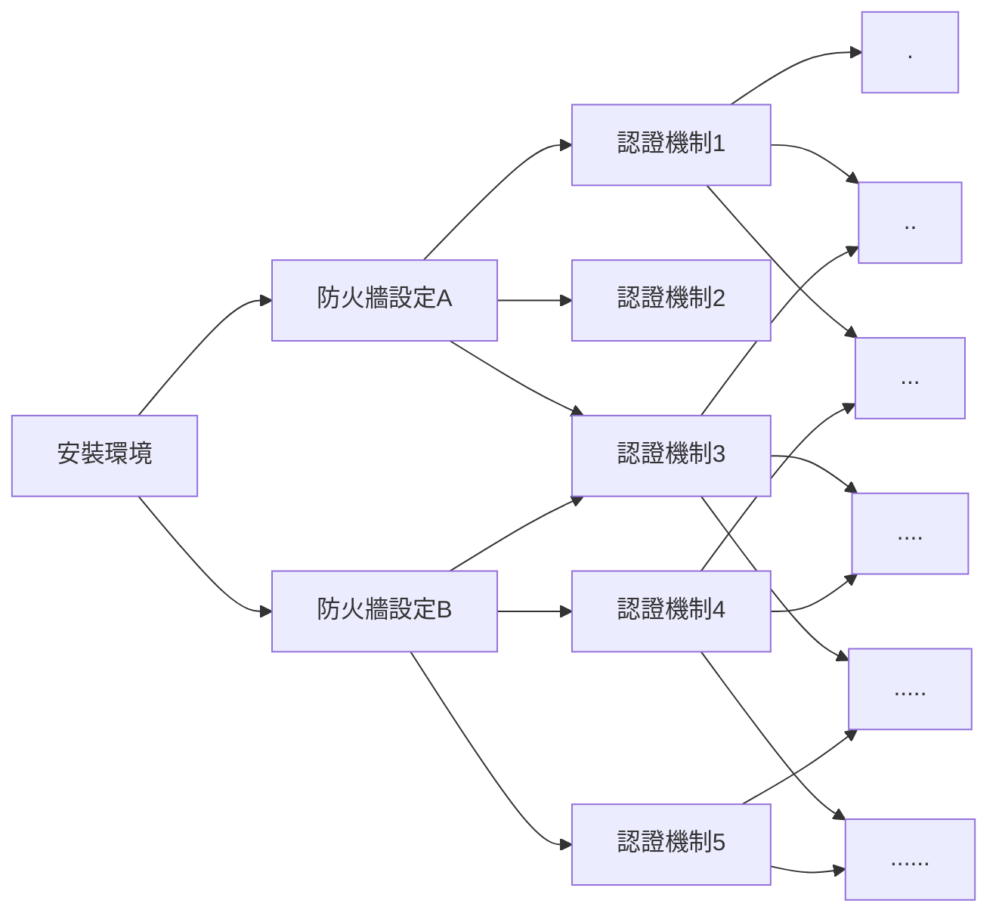

# Ansible 簡介

## Why Ansible

### 在一個 AWS instance 上架設伺服器：

1. 安裝環境 (Python、Docker...)
2. 設定防火牆、安裝/匯入認證
3. 安裝 AWS Cli tool
4. 設定 AWS Cli tool
5. Pull docker images<br/>
   ....<br/>
   ....<br/>
   ....<br/>
   


### 在四個 AWS instance 上架設伺服器：

重複以上步驟 x4


### 在一百個 AWS instance 上架設伺服器：

重複以上步驟 x100 :dizzy_face:


<iframe width="420" height="315"
src="https://www.youtube.com/embed/IMUT8EhTqJM">
</iframe>

:::success
:point_right: 需要一個工具可以重複執行相同步驟
:::

### 如果每個伺服器還有著不同的設定...:dizzy:


:::success
:point_right: 這個工具可以套用不同設定到模板來完成工作
:::

### 每架一個伺服器就要重新再安裝一次所有工具... :open_mouth::dash:
 


:::success
:point_right: 不用每台機器都需要重新安裝工具 (agentless)
:::

:::success
:point_right: 最好易懂易讀，容易上手
:::

## What is Ansible

### 甚麼是 Ansible：
:::warning
Ansible 是一套以 Python 為基底開發的組態管理工具
:::


### Ansible的優點：
* 免費: Anisble是一套免費的開源工具 (Redhat的AAP和Ansible Tower則是收費工具)。
* 模板化的設計: Anisble主要使用==YAML==和==Jinja2==模板語法來進行撰寫，可重複使用模板搭配不同的環境變數來執行各種IT工作。
* 不需在每個節點上安裝： 被控制的節點只需要安裝Python和SSH就可以統一由控制節點來進行控管，節省資源與時間。
* 易讀易懂：如前述所說，Ansible playbook (後面會在說明playbook是甚麼)的語法為YAML，YAML一開始就是被設計成容易編寫和閱讀的(雖然有些人會不認同XD)。
* 容易學習：只需要了解如何在Linux環境下工作以及理解如何使用SSH操控遠端機器就可以使用。

## How to use Ansible

### Ansible的基本架構：
### Playbook
Playbook是Ansible世界的一個專有名詞，
代表Ansible用來配置組態的一個腳本，以YAML來進行撰寫。
### Plays
Playbook由一連串的plays所組成，
每個Play包含：
* 一組想要進行組態配置的==主機(hosts)==
* 要在這些主機上執行的一系列==任務(tasks)==
### Tasks
Task為組成一個Playbook的最小單位，每個Task都必須包含一個==Key==。
Key代表了模組(module)的名稱以及要傳遞到模組的參數值。


以下是一個task的範例：
```yaml
- name: Install required packages
  apt:
    name: "{{ item }}"
    state: latest
    update_cache: true
  loop: "{{ required_package }}"
```

其中name是完全optional的，但是寫出來可讓同事(以及半年後的自己)比較能了解這個task的目的是甚麼。
apt就是前面講的key，表示我們要用apt這個模組來下達指令

### Modules
Module為Ansible原生已經包裝好的腳本，常見的有：
* apt: 使用apt套件管理員安裝或移除套件
* copy: 從本地機器複製檔案到本機其他位置或是其他主機
* file: 設定檔案、連結或目錄的屬性
* template: 使用Jinja模板生成檔案，並複製到主機中

所以前面例子的apt其實就是在command line打入
```s
$apt install {{package1}} {{package2}} {{package3}}... --latest
```

Ansible原生沒有包含的模組也可以用plugin的形式來擴充

### Plugins
就如同許多開源專案一樣，許多你想用的功能都已經有其他人幫你寫好了，只要下載下來安裝就可以使用。
例如常見的docker：
```yaml
- name: Create config foo (from a file on the target machine)
  community.docker.docker_config:
    name: foo
    data_src: /path/to/config/file
    state: present
```

docker前面的==community==就表示這是由開源社群所撰寫的plugin。

### Roles
隨著管理的規模和複雜度越來越高，Ansible也提供使用者可以用role來區分包裝不同的tasks
讓管理pipeline和task間的相依性更加容易
甚至使用者還可以去[Ansible Galaxy](https://galaxy.ansible.com/home)來下載其他人已經定義好的role來直接套用在專案使用。

### Facts (or Vars?)
使用者可以自訂義環境變數來套用在Ansible的模板裡
有許多方式可以定義環境變數，以下簡單舉例：
1. 直接寫在playbook中
```yaml
vars:
    key_file: /etc/nginx/ssl/test.key
    cert_file: /etc/nginx/ssl/test.crt
    server_name: localhost
```

2. 定義一個變數檔案
```yaml
vars_files:
    - nginx,yml
```

3. 執行 playbook 的時候設定
```s
$ ansible-playbook example.yml -e token=12345
```

4. 使用 set_fact
```yaml
- set_fact: app_version={{ example_app_versnio }}
```

要在run-time確定目前的變數是甚麼，可用debug key來印出變數的值：
```yaml
- name: Install path
    debug:
      msg: "Install path is {{ install_path }}."
```
:::success
:bulb: 定義變數的方式不同，其優先程度也不相同，例如直接用command line送進去的變數就會覆蓋掉playbook裡面原本有寫的變數
:::

### Anisble的結構
Ansible的結構如果圖形化之後大致是長這樣：
[圖片出處](https://www.clickittech.com/tutorial/ansible-playbook-basic/)

### 實際上來跑跑看：
### 以我們的 Smart Dock 來當示範
```
playbook/
├─ inventory/
│  ├─ smartdock.yml
│  ├─ user.yml
├─ roles/
│  ├─ docker/
│  │  ├─ default/
│  │  ├─ handler/
│  │  ├─ meta/
│  │  ├─ tasks/
│  │  ├─ test/
│  │  ├─ vars/
│  │  ├─ template/
│  ├─ certificates/
│  │  ├─ default/
│  │  ├─ handler/
│  │  ├─ meta/
│  │  ├─ tasks/
│  │  ├─ test/
│  │  ├─ vars/
│  │  ├─ template/
│  ├─ smartdock/
│  │  ├─ default/
│  │  ├─ handler/
│  │  ├─ meta/
│  │  ├─ tasks/
│  │  ├─ test/
│  │  ├─ vars/
│  │  ├─ template/
├─ ansible.cfg
├─ generate_self_signed_certificates.yml
├─ setup_smartdock_host.yml
├─ upgrade_smartdock_host.yml
```
### Config: ansible.cfg
```sh
[defaults]
host_key_checking = false
remote_user = ubuntu
ask_pass = false
roles_path = ./roles
inventory = hosts
display_skipped_hosts = false
# logs
log_path = ./ansible_logs/setup_logs

# grant root power
[privilege_escalation]
become = true
become_method = sudo
become_user = root
become_ask_pass = false
display_skipped_hosts = false
```
### Play: Setup Smart Dock Host
```yaml
# Play: Install Smart Dock Host
- hosts: localhost
  gather_facts: no

  vars_files:
  - "./inventory/smartdock.yml"
  - [ "/etc/smart-dock/user.yml", "./inventory/user.yml"]

  tasks:  
  - name: set current dir
    shell: "pwd"
    register: directory_out
  
  - set_fact: current_dir="{{ directory_out.stdout }}"  

  - fail:
      msg: Cannot find AWS access key ID and secret access key
    when: not aws_access_key_id|default(None) or not aws_secret_access_key|default(None)

  - name: Set install path
    pause:
      prompt: "Please specify your install path (default: /usr/local)"      
    register: install_path_input
    when: not install_path|default(None)

  - name: Set install path
    set_fact: 
      install_path="{{ install_path_input.user_input }}"
    when: not install_path|default(None)

  # If user press enter and skip the previous step
  - name: Set install path
    set_fact:
      install_path="/usr/local"
    when: not install_path|default(None)
  
  - name: Install path
    debug:
      msg: "Install path is {{ install_path }}."

  - name: create config directory
    file:
      path: "/etc/smart-dock"
      state: directory
      mode: '0755'

  - name: Save user configs
    ansible.builtin.template:
      src: "{{ current_dir }}/inventory/templates/user.j2"
      dest: "/etc/smart-dock/user.yml"
      mode: '0755'
      force: true

  - name: Check if certificates exist
    find:
      paths: ./certs
      patterns: "{{item}}"
    register: filesFound
    loop:
      - "ca.key"
      - "ca.pem"
      - "client.key"
      - "client.pem"
      - "openssl.cnf"

  - fail:
     msg: Cannot find self-signed certificates 
    when: item.matched == 0
    loop: "{{ filesFound.results }}"

  # Installing Packages
  - name: Install pip3
    apt:
      name: python3-pip
      state: latest
      update_cache: true

  - name: Upgrade pip
    pip:
      name: pip
      extra_args: --upgrade
      executable: pip3

  - name: Install boto3 python library
    pip:
      name: boto3
      state: present
    tags: services

  - name: Install boto python library
    pip:
      name: boto
      state: present
    tags: services

  # Import Role: Docker
  - name: Install and start docker service
    include_role:      
      name: docker
    tags: services
  
  # Import Role: Certificates
  - name: create letsencrypt certificates
    import_role:
      name: certificates
      tasks_from: letsencrypt_webroot
    when: certificate == "letsencrypt"
    tags: [services, certs]

  # Import Role: Smart Dock
  - name: Install smartdock server
    import_role:      
      name: smartdock
      tasks_from: setup_smartdock_server
    tags: smartdock
```
### Tasks File in Role: Smart Dock
```yaml
---
# tasks file for smartdock
- name: Install AWS CLI
  import_role:      
      name: smartdock
      tasks_from: install_aws_cli
  when: docker_storage == "aws"
  
- name: Log into a Docker Registry
  docker_login:
    username: "{{docker_hub_username}}"
    password: "{{docker_hub_password}}"
    email: "{{docker_hub_email}}"
  when: docker_storage == "dockerhub"

- name: Set user AWS access key id
  shell: "aws configure set aws_access_key_id {{aws_access_key_id}} --profile user"
  when: aws_access_key_id and aws_secret_access_key and docker_storage == "aws"

- name: Set user AWS access key
  shell: "aws configure set aws_secret_access_key {{aws_secret_access_key}} --profile user"
  when: aws_access_key_id and aws_secret_access_key and docker_storage == "aws"

- name: Set user AWS region
  shell: "aws configure set region {{aws_region}} --profile user"
  when: aws_access_key_id and aws_secret_access_key and docker_storage == "aws"

- name: ecr docker get-authorization-token
  shell: "aws ecr get-authorization-token --profile user --region {{aws_erc_region}}"
  register: ecr_command
  when: docker_storage == "aws"
  
- set_fact: ecr_authorization_data="{{ (ecr_command.stdout | from_json).authorizationData[0] }}"
  when: docker_storage == "aws"
  
- set_fact: ecr_credentials="{{ (ecr_authorization_data.authorizationToken | b64decode).split(':') }}"
  when: docker_storage == "aws"

- name: Log into a ECR Docker Registry
  docker_login:
      registry_url: "{{ ecr_authorization_data.proxyEndpoint.rpartition('//')[2] }}"
      username: "{{ ecr_credentials[0] }}"
      password: "{{ ecr_credentials[1] }}"
      reauthorize: yes
  when: docker_storage == "aws"

- name: pull emqx
  docker_image:
    name: emqx/emqx:{{emqx_version}}
    source: pull
  
- name: Pull timescale DB
  docker_image:
    name: timescale/timescaledb-postgis:latest-pg12
    source: pull

- name: Pull minIO
  docker_image:
    name: quay.io/minio/minio:{{minio_version}}
    source: pull
  
- set_fact: image_directory={{docker_hub_username}}
  when: docker_storage == "dockerhub"

- set_fact: restapi_folder="smartlocation-restapi-alpine"
  when: docker_storage == "dockerhub"

- set_fact: websocket_folder="smartlocation-websocket-alpine"
  when: docker_storage == "dockerhub"

- set_fact: image_directory={{aws_erc_repository}}
  when: docker_storage == "aws"

- set_fact: restapi_folder="smartdock-rest"
  when: docker_storage == "aws"

- set_fact: websocket_folder="websocket-alpine"
  when: docker_storage == "aws"
    
- name: Pull restapi image
  docker_image:
    name: "{{image_directory}}/{{restapi_folder}}:{{restapi_version}}"
    source: pull  

- name: Pull websocket image
  docker_image:
    name: "{{image_directory}}/{{websocket_folder}}:{{websocket_version}}"
    source: pull

- name: Pull device-routing image
  docker_image:
    name: "{{image_directory}}/devicerouting:{{devicerouting_version}}"
    source: pull
  
- name: Pull website image
  docker_image:
    name: "{{image_directory}}/smartdock-web:{{web_version}}"
    source: pull

- name: Pull admin site image
  docker_image:
    name: "{{image_directory}}/smartdock-admin-site:{{admin_site_version}}"
    source: pull

- name: Pull node-cron image
  docker_image:
    name: "{{image_directory}}/smartlocation-node-cron:{{cron_version}}"
    source: pull

- name: Create folder ascii tree
  import_role:      
    name: smartdock
    tasks_from: create_ascii_tree

- name: Create config.json
  import_role:      
    name: smartdock
    tasks_from: generate_jsons

- name: Create tokens if not exist
  import_role:      
    name: smartdock
    tasks_from: generate_tokens

- name: Copy files
  copy:
    src: "../templates/{{item}}"
    dest: "{{ install_path }}/smart-dock/certificates/aws_certs/{{item}}"
    mode: 0755
  loop:      
    - "AmazonRootCA1.pem"
    - "IotCoreMQTTCert.pem.crt"
    - "IotCoreMQTTPrivate.pem.key" 

- name: Copy self-signed certificates into install path
  copy:
    src: "{{current_dir}}/certs/{{item}}"
    dest: "{{ install_path }}/smart-dock/certificates/self_signed_certs/{{item}}"
    mode: 0755
  loop:
    - "ca.key"
    - "ca.pem"
    - "ca.srl"
    - "client.csr"
    - "client.key"
    - "client.pem"
    - "openssl.cnf"

- set_fact: port={{portal_port}}

- name: Create portal_nginx.conf from template
  ansible.builtin.template:
    src: ../templates/nginx.j2
    dest: "{{ install_path }}/smart-dock/env/portal_nginx.conf"

- set_fact: port={{admin_site_port}}

- name: Create admin_site_nginx.conf from template
  ansible.builtin.template:
    src: ../templates/nginx.j2
    dest: "{{ install_path }}/smart-dock/env/admin_site_nginx.conf"

- name: Create env files from template
  ansible.builtin.template:
    src: ../templates/{{item}}.j2
    dest: "{{ install_path }}/smart-dock/env/{{item}}.env"
  loop:
    - "emqx"
    - "websocket"
    - "restapi"
    - "timescale"    
    - "device_routing"
    - "cron_30min"
    - "cron_1min"
    - "minio"

- name: Create compose file from template
  ansible.builtin.template:
    src: ../templates/docker-compose_letsencrypt.j2
    dest: "{{ install_path }}/smart-dock/docker-compose.yml"
  when: certificate == "letsencrypt"

- name: Create compose file from template
  ansible.builtin.template:
    src: ../templates/docker-compose_self-signed.j2
    dest: "{{ install_path }}/smart-dock/docker-compose.yml"
  when: certificate == "self-signed"

- name: Create utility files from template
  ansible.builtin.template:
    src: ../templates/healthCheck.j2
    dest: "{{ install_path }}/smart-dock/scripts/healthCheck.sh"

- name: Launch container by docker compose
  community.docker.docker_compose:
    project_src: "{{ install_path }}/smart-dock"

- name: Make sure certificates are accessible
  command: docker exec smartdock-emqx sudo chmod 755 -R /home
  become: true
  become_method: sudo

- name: Wait until emqx is healthy (please ignore failed messages)
  community.docker.docker_container_info:
    name: smartdock-emqx
  register: emqxhealth
  until: emqxhealth.container['State']['Health']['Status'] == "healthy"
  delay: 10
  retries: 10
  ignore_errors: true

- name: Print status
  ansible.builtin.debug:
    msg: "MQTT's health is {{ emqxhealth.container['State']['Health']['Status'] }}"
  when: emqxhealth.container['State']['Health']['Status'] == "healthy" or emqxhealth.container['State']['Health']['Status'] == "unhealthy"

- name: Restart restapi
  command: docker restart smartdock-restapi
  become: true
  become_method: sudo
  when: emqxhealth.container['State']['Health']['Status'] == "healthy"

- name: Restart websocket
  command: docker restart smartdock-websocket
  become: true
  become_method: sudo
  when: emqxhealth.container['State']['Health']['Status'] == "healthy"

- name: Stop container by docker compose down
  community.docker.docker_compose:
    project_src: "{{ install_path }}/smart-dock"
    state: absent
  when: emqxhealth.container['State']['Health']['Status'] == "unhealthy"

- name: Restart container by docker compose
  community.docker.docker_compose:
    project_src: "{{ install_path }}/smart-dock"
  when: emqxhealth.container['State']['Health']['Status'] == "unhealthy"

- name: Creates a cron file under /etc/cron.d
  ansible.builtin.cron:
    name: smartdock-cron-job-30-min
    minute: "0,30"
    user: root
    job: "docker start smartdock-cron-30-min"
    cron_file: smartdock-cron-job

- name: Creates a cron file under /etc/cron.d
  ansible.builtin.cron:
    name: smartdock-cron-job-1-min
    minute: "*"
    user: root
    job: "docker start smartdock-cron-1-min"
    cron_file: smartdock-cron-job

- name: Creates postgres backup folder
  file:
    path: "{{ install_path }}/smart-dock/backups"
    state: directory
    mode: '0755'  

- name: Generate scripts in scripts folder
  ansible.builtin.template:
    src: "./scripts/{{item}}.j2"
    dest: "{{ install_path }}/smart-dock/scripts/{{item}}.sh"
    mode: '0755'
    force: true
  loop:
    - "backup"
    - "recovery"
    - "uninstall"

- name: Copy scripts to scripts folder
  copy:
    src: "./scripts/{{item}}.sh"
    dest: "{{ install_path }}/smart-dock/scripts/{{item}}.sh"
    mode: '0755'
    force: true
  loop:
    - "checkStatuses"

- name: Creates a cron file under /etc/cron.d for database backup (DEBUG MODE)
  ansible.builtin.cron:
    name: smartdock-database-backup-cron-job
    minute: "0,10,20,30,40,50"
    user: root
    job: "bash {{ install_path }}/smart-dock/scripts/backup.sh"
    cron_file: smartdock-cron-job
  when: backup_freq == "debug"

- name: Creates a cron file under /etc/cron.d for database backup (Daily)
  ansible.builtin.cron:
    name: smartdock-database-backup-cron-job
    hour: "5"
    minute: "0"
    user: root
    job: "bash {{ install_path }}/smart-dock/scripts/backup.sh"
    cron_file: smartdock-cron-job
  when: backup_freq == "daily"

- name: Creates a cron file under /etc/cron.d for database backup (Weekly)
  ansible.builtin.cron:
    name: smartdock-database-backup-cron-job
    weekday: "6"
    hour: "5"
    minute: "0"
    user: root
    job: "bash {{ install_path }}/smart-dock/scripts/backup.sh"
    cron_file: smartdock-cron-job
  when: backup_freq == "weekly"

- name: Creates a cron file to check system health regularly
  ansible.builtin.cron:
    name: smartdock-healthcheck-cron-job    
    minute: "10,25,40,55"
    user: root
    job: "bash {{ install_path }}/smart-dock/scripts/healthCheck.sh"
    cron_file: smartdock-cron-job
```
## 下期預告
1. 如何使用 Ansible Galaxy
2. 遠端調控多個 hosts 的組態
## Reference
[Ansible Documentation](https://docs.ansible.com/ansible/latest/dev_guide/index.html);<br/>
[Ansible建置與執行 O'Reilly](https://www.amazon.com/Ansible-Automating-Configuration-Management-Deployment/dp/1491915323);<br/>
###### tags: `ansible`,`note`